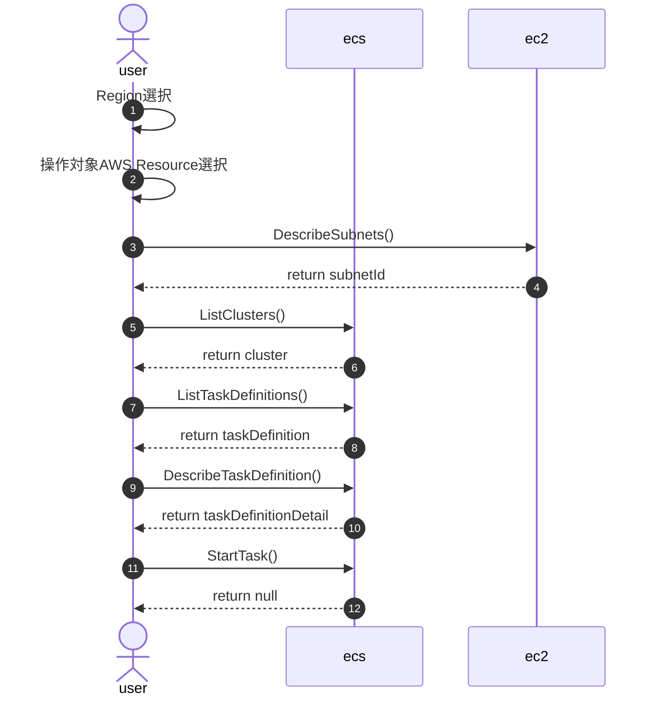

# StartTask

```mermaid
sequenceDiagram
  autonumber
  actor user
  participant ecs
  participant ec2

  user ->> user: Region選択
  user ->> user: 操作対象AWS Resource選択

  user ->> ec2: DescribeSubnets()
  ec2 -->> user: return subnetId

  user ->> ecs: ListClusters()
  ecs -->> user: return cluster

  user ->> ecs: ListTaskDefinitions()
  ecs -->> user: return taskDefinition

  user ->> ecs: DescribeTaskDefinition()
  ecs -->> user: return taskDefinitionDetail

  user ->> ecs: StartTask()
  ecs -->> user: return null
```
