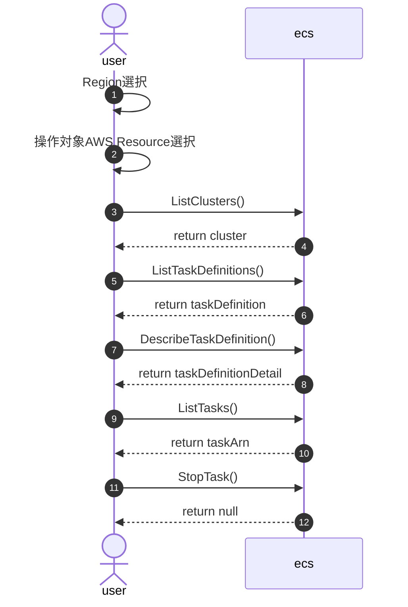

# StopTask

```mermaid
sequenceDiagram
  autonumber
  actor user
  participant ecs

  user ->> user: Region選択
  user ->> user: 操作対象AWS Resource選択

  user ->> ecs: ListClusters()
  ecs -->> user: return cluster

  user ->> ecs: ListTaskDefinitions()
  ecs -->> user: return taskDefinition

  user ->> ecs: DescribeTaskDefinition()
  ecs -->> user: return taskDefinitionDetail

  user ->> ecs: ListTasks()
  ecs -->> user: return taskArn

  user ->> ecs: StopTask()
  ecs -->> user: return null
```
