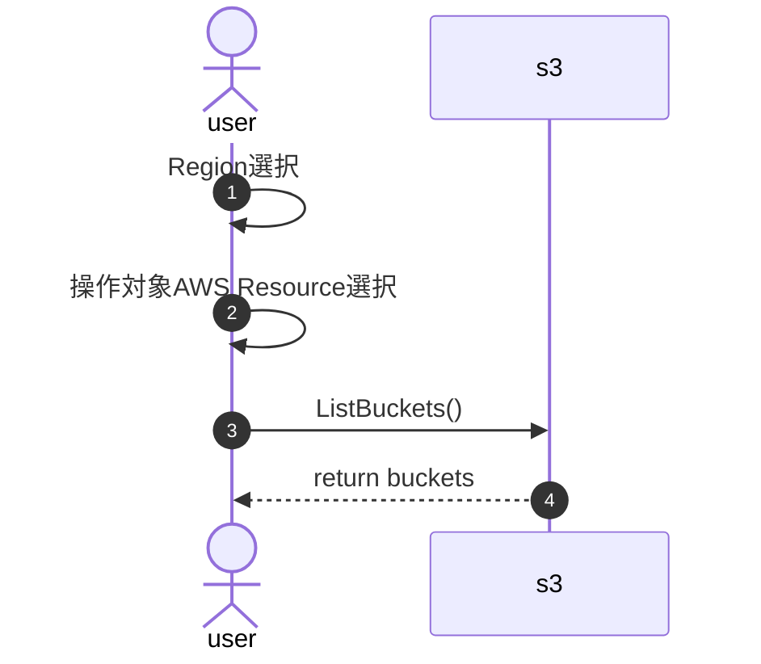

# ListBuckets

```mermaid
sequenceDiagram
  autonumber
  actor user
  participant s3

  user ->> user: Region選択
  user ->> user: 操作対象AWS Resource選択

  user ->> s3: ListBuckets()
  s3 -->> user: return buckets
```
